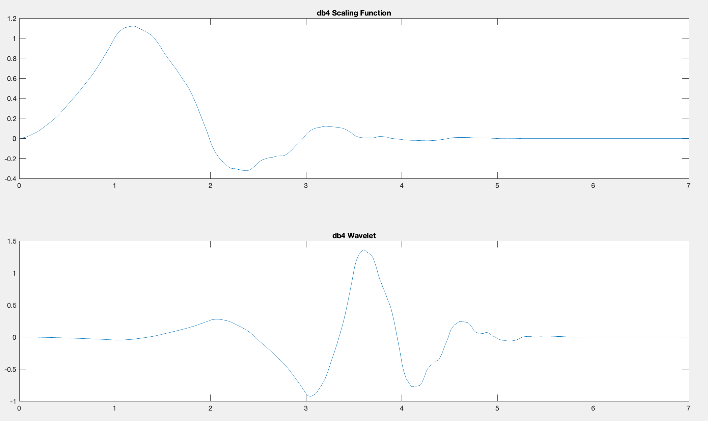
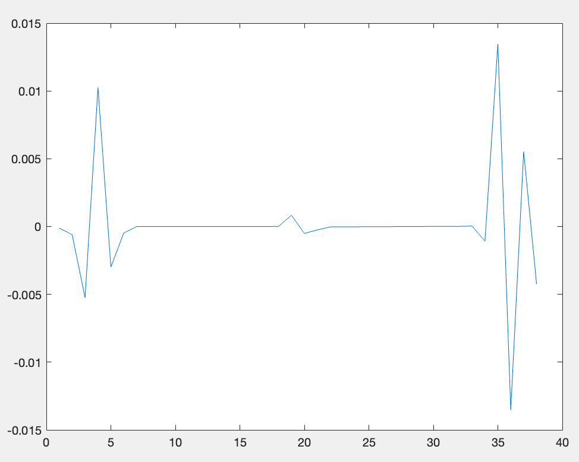

\pagebreak
```{r setup, echo=FALSE,  }
library(reticulate)
knitr::opts_chunk$set(cache = FALSE, echo = FALSE,fig.align= 'center')
knitr::knit_engines$set(python = reticulate::eng_python)

use_python("../env/bin/python")

```


```{python, include=FALSE}
from scipy.io import loadmat

info = loadmat('./signal.mat');

scddvbrk=info['scddvbrk'][0]
sig=info['signal'][0]
N = len(sig)
```

# Plot de señal

Asumimos que $f_s = 1$

```{python, echo=FALSE}
import matplotlib.pyplot as plt

plt.ylabel('Signal');
plt.xlabel('Time [sec]');
x=list(range(len(sig)));
plt.plot(x, sig);

plt.show();
plt.close();
```

Desde lejos, la señal no parece tener ninguna peculiaridad apreciable.

# Uso del espectrograma

Podemos representar el espectrograma

```{python, echo=FALSE,}
import matplotlib.pyplot as plt
#matplotlib.rcsetup.interactive_bk
#matplotlib.rcsetup.non_interactive_bk
# https://stackoverflow.com/a/5092255
# TODO: Might be broken -> from  matplotlib import pyplot as plt
from scipy import signal
f, t, Sxx = signal.spectrogram(sig);

plt.pcolormesh(t, f, Sxx, shading='gouraud', snap=True, rasterized=True);
plt.ylabel('Frequency [Hz]');
plt.xlabel('Time [sec]');
plt.show();
plt.close();
```

Se ve cómo a partir de $s\approx 600$ empezamos a ver un cambio a frecuencias bajas. (Haga zoom si no se aprecia en la esquina de abajo a la derecha)

\pagebreak
# Uso de wavelet


## $\Psi$ y $\Phi$

Representamos el wavelet `db4` de la familia Daubechies.

```{comment, eval=FALSE, include=FALSE}
[phi,psi,xval] = wavefun('db4');
subplot(211);
plot(xval,phi);
title('db4 Scaling Function');
subplot(212);
plot(xval,psi);
title('db4 Wavelet');


```

```{r, fig.cap="Ejemplo calculado con la ayuda de Matlab's help page", out.width="70%"}
# (https://www.mathworks.com/help/wavelet/ug/wavelet-families-additional-discussion.html)

```

## Wavelet contínuo

```{python, eval=FALSE, include=FALSE}
# It does NOTE WORK
# import pywt
# import matplotlib.pyplot as plt
#
# db4 = pywt.ContinuousWavelet('db4')
#
# assert db4.orthogonal, "Non orthogonal wavelets require a different treatment https://pywavelets.readthedocs.io/en/latest/regression/wavelet.html"
#
# # Scaling function and wavelet function
# phi, psi, x =db4.wavefun(level=1, length=1000)
#
# plt.plot(x, phi, label="$\phi$")
# plt.plot(x, psi, label="$\psi$")
#
# plt.legend()
# plt.show()
# plt.close()
```

Realizando la transformada continua para tratar de encontrar si podemos ver algún cambio.

Usamos dos programas distintos, usando dos wavelets distintos, para aprender, y comparar como funcionan.

Primero, con scipy's signal.cwt

```{python}

from scipy import signal
import matplotlib.pyplot as plt
import numpy as np
widths = np.arange(1,128);
cwtmatr = signal.cwt(sig, signal.ricker, widths);
plt.imshow(
  cwtmatr,
  extent=[1, N, 1, 128],
  aspect='auto',
  interpolation="none",
  origin="lower",
  );
plt.xlabel("Time");
plt.ylabel("$widths$");
plt.title("CWT with ricker wavelet");
plt.colorbar();
plt.show();
plt.close();
```

Luego con `pywavelets` usando un wavelet gaussiana (`gaus1`)
```{python}
import pywt
import matplotlib.pyplot as plt
coefs, frequencies = pywt.cwt(sig, widths, 'gaus1');
plt.axes().get_yaxis().set_visible(False);

plt.imshow(
  coefs,
  extent=[1, N, frequencies[0], frequencies[-1]],
  aspect='auto',
  interpolation="none",
  origin="lower",
  cmap='PRGn',
  vmax=(coefs).max(),
  vmin=(coefs).min(),
  );
plt.xlabel("Time");
plt.ylabel("frecuencias $\omega$ (not linear scale)");
plt.title("CWT with gaus1 wavelet");
plt.colorbar();


plt.show();
plt.close();

```

Se puede apreciar un cambio cerca de $t\approx 600$ en ambos casos.


## Wavelet discreto

Computando el discrete wavelet transform (dwt), no se ve ningún pico en el primer nivel. Al llegar a niveles más altos, se observa al quinto nivel de detalle más pronunciado, y a niveles más altos se vuelve a obfuscar este cambio. (Que concide con el resultado con el CWT, por lo que no nos hemos preocupado tanto por obtener un cuadrado)

```{python}

import pywt
import matplotlib.pyplot as plt
wavelet=pywt.Wavelet('db4');

coef_approximation, coef_detail = pywt.dwt(sig[:-1], wavelet, mode=pywt.Modes.zero);
s=list(range(0, len(coef_approximation)));
plt.plot(s, coef_approximation, label="Approximation (level 1)");
plt.plot(s, coef_detail, label="Detail (level 1)p");
plt.legend();
plt.show();
plt.close();
```
```{r, out.width="50%",fig.cap="Nivel 5 de detalle de db4 en nuestra señal de origen. El eje $x$ enumera los samples del nivel 5."}
;

```

En el análisis discreto, este es el nivel en el que se veía mejor, con el wavelet db4 representado más arriba. Nótese que el eje $X$ no corresponde al tiempo, ya que el sampling se divide por dos en cada nivel, sino que a un sampling con $f_s=2^5$. Teniendo esto en cuenta, el cambio se produce approximadamente a $t\approx 19\cdot2^5\approx600$, que es un milagro que coincida con el resto de resultados. Nótese como nuestra resolución en este nivel es de 32 unidades, asi que tratar de ser más acertados que 600 no tiene mérito


```{comment, eval=FALSE, include=FALSE}
[phi,psi,xval] = wavefun('db4');
subplot(211);
plot(xval,phi);
title('db4 Scaling Function');
subplot(212);
plot(xval,psi);
title('db4 Wavelet');

dwt(signal, 'db4');

plot(a);

[w, ref] = wavedec(signal, 20, 'db4');

lvl=detcoef(w, ref, 8);
plot(lvl)
```


# Conclusión

Existe una onda de muy baja frequencia que se puede filtrar digitalmente con wavelets, lo cual seria muy dificil obtener con un metodo sin profundidad temporal.
